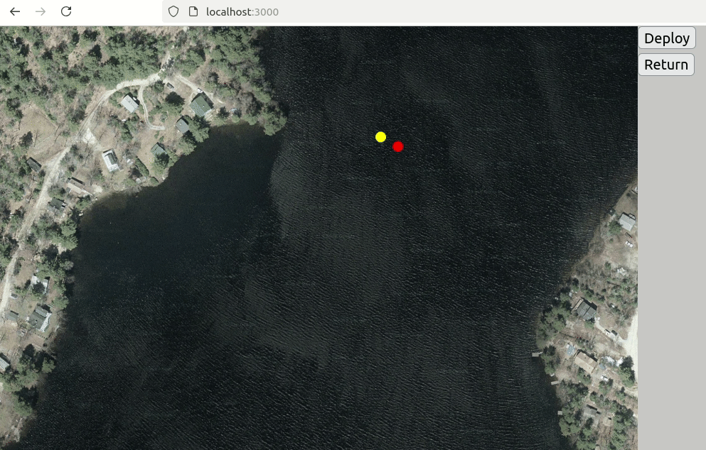

# WebMOOS
This repo is a simple proof-of-concept for a complete high-level autonomy simulation framework using MOOS-IvP.

WebMOOS adds a simple Python-based FastAPI app that serves as a bridge between the MOOS-IvP middleware and a dead-simple web-UI based on p5.js, for easy enhancement.

Individual components (the web ui, the api, and the MOOS-IvP autonomy system) can be individually run on bare-metal if desired.

## MOOS-IvP
[MOOS-IvP](https://oceanai.mit.edu/moos-ivp/pmwiki/pmwiki.php) is a lightweight middleware and behavior-based autonomy architecture maintained by the MIT Marine Autonomy lab. 

## Fleet Configuration
The base docker-compose file provides a simple example 2-vehicle mission with all MOOS communities run in the autonomy container, but the `docker-compose.fleet.yaml` file and `docker_2680.sh` entrypoint provide a more distributed approach, with individual vehicles defined in their own docker containers. Note that the fleet file does not currently include the webui and api containers.

The base fleet configuration was written with the MIT Marine Autonomy Lab Swimmer Rescue scenario in mind and should make it a little easier to run alternative autonomy setups. You can either copy the `autonomy` directory to test out other behaviors or apps, or you can simply clone this repo to the same directory as your `moos-ivp-2680` and `moos-ivp-extend` repos, and map them in your docker-compose file.

Each vehicle container (clayton, mathew, jeremy, josh) has an `EXTENDLIB` and `EXTENDBIN` env var that defines the path for additional executables and behavior libraries you may want to use in your simulation. By default, those files must also be mounted in the container `volumes` option. Variables that should be the same across MOOS communities (like `TIMEWARP`) can be defined in the `globals.env` file.